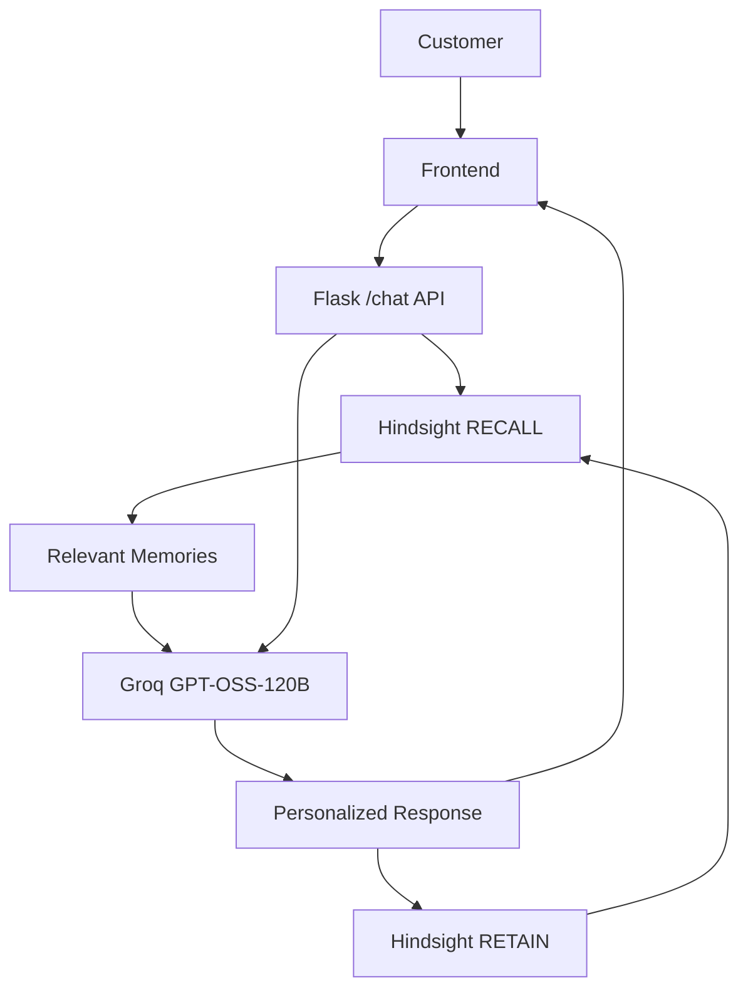

# Memory-Powered Customer Support Agent

HackwithHyderabad 3.0 project demonstrating an AI customer-support workflow with persistent memory powered by Hindsight.

## Overview

The Memory-Powered Customer Support Agent is a Flask web application that recalls relevant customer interactions before generating a support response. It sends the current message and recalled context to Groq's `openai/gpt-oss-120b` model, then retains the new customer-assistant exchange in Hindsight for future queries.

The project uses memory as an external context layer. It does not fine-tune the model or update model weights.

## Problem Statement

Customer-support conversations often require people to repeat the same details. When previous context is unavailable, an agent may produce generic responses and cannot effectively reuse earlier troubleshooting steps or resolutions.

## Solution

This project adds persistent memory to the support workflow. Hindsight retrieves relevant previous experiences for the current customer message, allowing the LLM to generate a response with more useful context. After the response is generated, the new interaction is stored for later recall.

## Key Idea

```text
RECALL -> CONTEXT -> LLM -> RESPONSE -> RETAIN
```

The current message is used as the recall query. The returned memories become part of the LLM prompt, and the resulting customer message plus assistant response is retained in the Hindsight memory bank.

## Architecture



The return path from `Hindsight RETAIN` to `RECALL` represents availability of the stored interaction to future requests. The current message is also passed directly to the LLM together with the recalled memories.

## How Hindsight Is Used

The application uses the Hindsight client with the memory bank ID `customer-support-agent`.

### RECALL

When `POST /chat` receives a non-empty message, the message is passed as the Hindsight recall query:

```python
client.recall(bank_id="customer-support-agent", query=user_message)
```

The resulting value is passed to the LLM service. The LLM formats the recalled values as relevant past memories alongside the current customer message.

### RETAIN

After the LLM returns a response, the application stores the interaction in the same bank using this content format:

```text
Customer: <user message>
Assistant: <generated response>
```

The retain call uses the context label `customer_support`.

### Why Memory Matters

Hindsight is central to the project because it supplies context across separate requests. The memory layer is part of the support decision flow, not only a visual element in the interface: recalled experiences influence the prompt used to generate the response, and each completed exchange becomes available for future recall.

## Example Interaction

First interaction:

```text
Customer: My payment failed while using the Android app.
```

The application sends the message through `/chat`, generates a response, and retains the customer message together with that response.

Second interaction:

```text
Customer: My payment failed again.
```

Hindsight can use this new message to retrieve relevant previous context. That context is supplied to the LLM with the current message, allowing the model to consider the earlier interaction when generating its response. The exact memories and response depend on the configured Hindsight bank and model output.

## Technology Stack

| Technology | Purpose |
| --- | --- |
| Python | Application language |
| Flask | Web server and `/chat` API |
| Hindsight | Persistent memory layer for recall and retain |
| `hindsight-client` | Python client used to call Hindsight |
| Groq | LLM API provider |
| `openai/gpt-oss-120b` | Customer-support response model |
| HTML | Web interface structure |
| CSS | Interface styling and responsive layout |
| JavaScript | Chat submission and memory rendering in the browser |
| `python-dotenv` | Loads configuration from `.env` |

## Project Structure

```text
Portfolio/
├── app.py
├── services/
│   ├── hindsight.py
│   └── llm.py
├── templates/
│   └── index.html
├── static/
│   ├── layout.css
│   ├── script.js
│   └── style.css
├── setup_hindsight.py
├── test_memory.py
├── test_agent.py
├── requirements.txt
├── .env
└── README.md
```

Generated virtual-environment and Python cache files are intentionally omitted from this overview.

## Installation

The commands below are for Windows PowerShell.

1. Clone the repository and enter the project directory:

   ```powershell
   git clone [Repository URL]
   cd Portfolio
   ```

2. Create a virtual environment:

   ```powershell
   python -m venv venv
   ```

3. Activate it:

   ```powershell
   .\venv\Scripts\Activate.ps1
   ```

4. Install the dependencies used by the current source code. `requirements.txt` is present but currently empty, so install them explicitly:

   ```powershell
   pip install Flask hindsight-client groq python-dotenv
   ```

5. Create a `.env` file in the project root:

   ```env
   HINDSIGHT_BASE_URL=https://your-hindsight-base-url
   HINDSIGHT_API_KEY=your-hindsight-api-key
   GROQ_API_KEY=your-groq-api-key
   ```

6. Configure valid Hindsight and Groq credentials using the placeholders above. The application loads these variables with `python-dotenv`.

7. Optionally initialize the memory bank:

   ```powershell
   python setup_hindsight.py
   ```

Never commit `.env`, expose API keys, or paste real credentials into this README. Keep `.env` in `.gitignore`.

## Running the Application

Start the Flask application from the project root:

```powershell
python app.py
```

Open [http://127.0.0.1:5000/](http://127.0.0.1:5000/) in a browser.

The interface displays a customer panel, conversation area, Hindsight connection status, and relevant-memory panel. The browser submits chat messages to `/chat` and renders the returned response and memories. The visible PDF upload control currently calls `/upload`, but no `/upload` route is implemented in `app.py`.

## Testing

`test_memory.py` directly retains a sample Rahul payment-failure interaction in Hindsight, recalls it with a related query, and prints the returned memory text.

`test_agent.py` is intended to demonstrate recall, response generation, and retaining a new interaction. In the inspected version, it imports `remember_interaction` and `generate_response`, while the current service modules define `retain_memory` and `get_support_response`; therefore this script does not match the current implementation and requires alignment before it can run successfully.

For an end-to-end UI check:

1. Start the application and send `My payment failed while using the Android app.`
2. Send `My payment failed again.` in the same interface.
3. Confirm that the second `/chat` response includes a `memories` value and that the memory panel renders returned entries when Hindsight provides them.

## API

### `POST /chat`

Receives a customer message, recalls relevant memories, generates an LLM response, retains the interaction, and returns the response plus recalled memories.

Request JSON:

```json
{
  "message": "My payment failed again."
}
```

Response JSON:

```json
{
  "response": "...",
  "memories": []
}
```

`memories` contains the value returned by Hindsight recall and may contain memory objects rather than strings, depending on the client response.

If `message` is missing or empty after trimming, the endpoint returns HTTP `400`:

```json
{
  "error": "Message is required"
}
```

## Demo Flow

1. Introduce the problem of repeated customer explanations and lost support context.
2. Submit the first payment-failure interaction.
3. Explain that the completed exchange is retained in Hindsight.
4. Submit a related follow-up question.
5. Show the relevant memories returned by Hindsight.
6. Show the response generated using the current message and recalled context.
7. Explain why persistent memory matters for repeated support interactions.

## Why Hindsight Is Central

Without persistent memory, the workflow is essentially:

```text
Customer -> LLM -> Response
```

This project uses:

```text
Customer -> RECALL -> Relevant Memory -> LLM -> Response -> RETAIN
```

That additional loop gives the LLM relevant previous experiences when a customer returns with a related issue. Retaining each exchange also creates context that future requests can recall, without changing the model's weights.

## Limitations

- This is a prototype customer-support workflow.
- The application does not implement production authentication or customer identity management.
- No production deployment, ticketing integration, analytics, or human-agent handoff is implemented.
- The current API exposes one shared Hindsight bank ID: `customer-support-agent`.
- The checked-in `requirements.txt` is empty and should be populated for reproducible installation.
- The visible PDF upload control has no matching Flask `/upload` endpoint in the current backend.

## Future Improvements

The following are future work, not current features:

- Multiple customer profiles and customer identity management
- Support-ticket integration
- Human-agent escalation
- Analytics and production monitoring
- Richer memory controls, filtering, and deletion policies
- A production-ready dependency lock or populated `requirements.txt`

## Security Notes

- Keep all API keys in `.env` and never commit that file.
- Use proper secret management for production deployments.
- Treat customer messages and retained memory as sensitive data.
- Apply appropriate access controls, retention policies, and privacy protections before using real customer data.

## Hackathon Context

Built for HackwithHyderabad 3.0, this project explores AI agents with persistent memory. Hindsight is the core memory layer that connects previous customer interactions to the current support response.

## Project Resources

- GitHub: [Repository URL]
- Demo Video: [Video URL]
- Live Demo: [Live Demo URL]
- Article: [Article URL]

## Team

[Add team members here]
